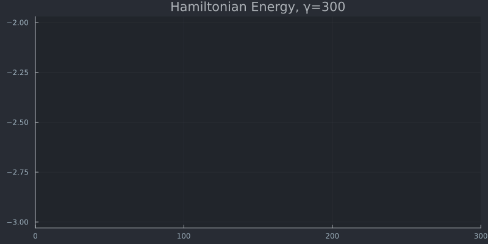

# Collective Active Inference "Ising model"
A simple simulation project of the Ising model implemented using a collection of active inference agents. Each agent represents a "spin", where the observation of each agent is determined by its own state and the action of its neighbors at t-1 and a prior preference for the alignment with its neighbors.

### 1D lattice

### 2D lattice 
### 3D lattice 
